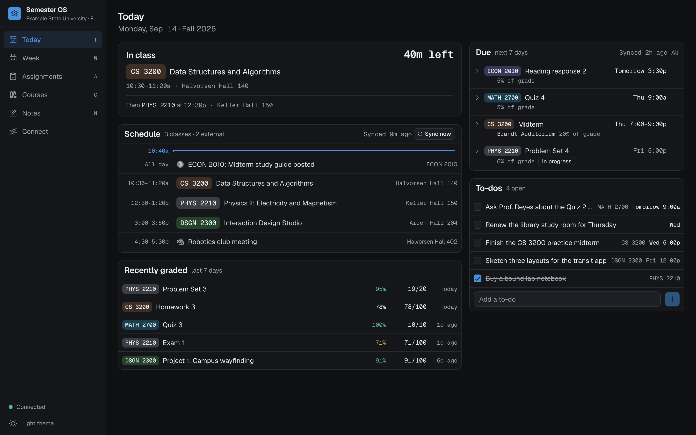
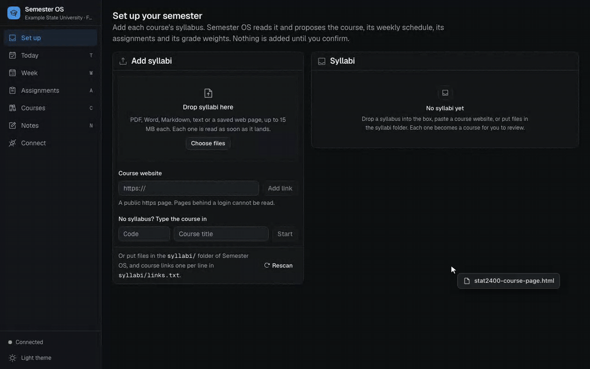
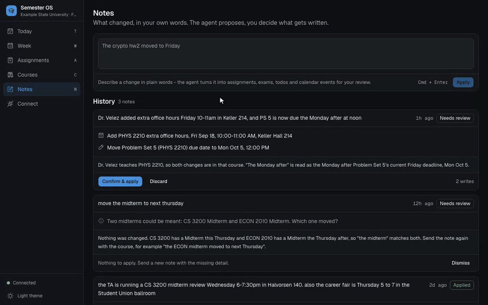
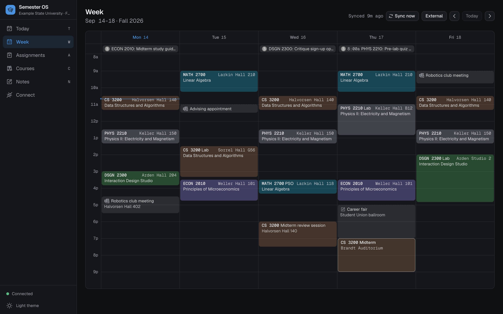
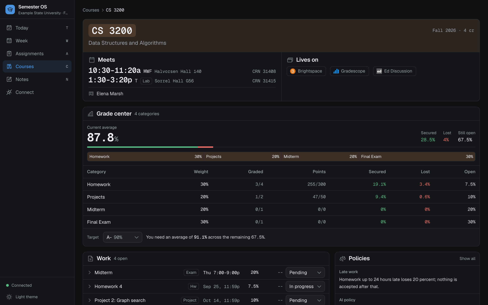
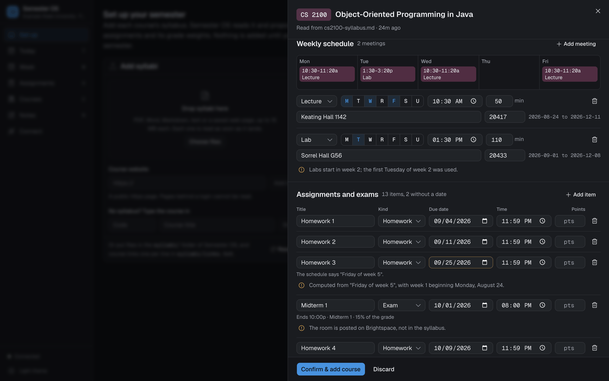
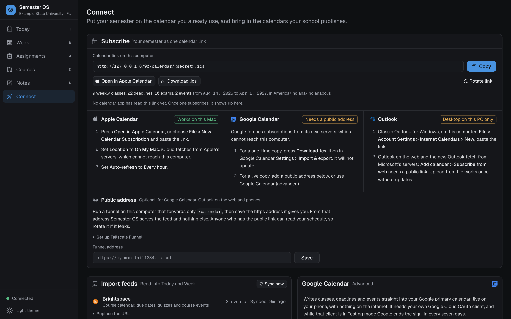
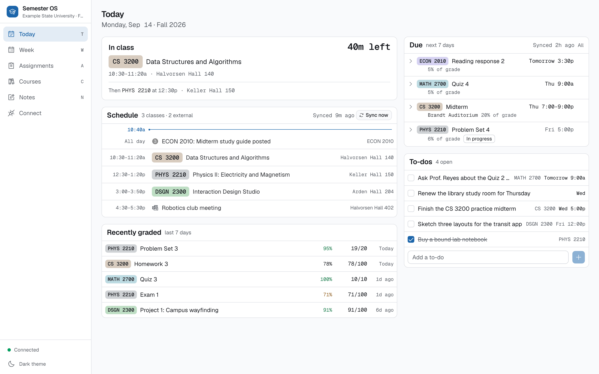
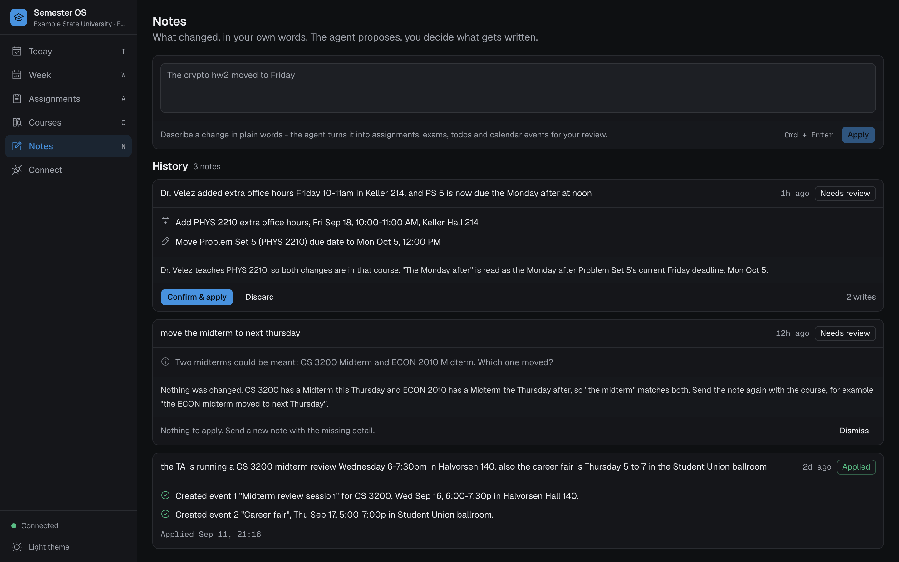
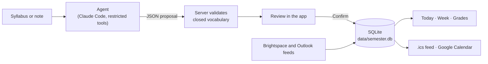

<h1 align="center">Semester OS</h1>

<p align="center">
  <strong>Your whole semester in one local dashboard: every class, deadline and grade, read from your syllabi.</strong>
</p>

<p align="center">
  <a href="https://github.com/mmorenow/semester-os/actions/workflows/ci.yml"></a>
  <a href="LICENSE"></a>
  
  
</p>

<p align="center">
  
</p>

## Features

- **Syllabus onboarding.** Drop a syllabus (PDF, Word, Markdown, HTML) or paste a course URL. An agent proposes the course, schedule, assignments and weights, and flags anything unclear.
- **Today and Week.** What is on now, what is due, and a week grid in course colors.
- **Grade center.** Current average, and what you need on the rest to reach a target.
- **Notes.** Type *"Midterm 2 moved to next Thursday, 7-9pm in LAB 101"*. An agent proposes the change; you confirm it.
- **Calendars.** A subscribable `.ics` feed, Brightspace and Outlook imports, optional Google Calendar sync.

<p align="center">
  
</p>

<p align="center">
  
</p>

<details>
<summary>More screenshots</summary>
<br>






</details>

## Quick start

```sh
git clone https://github.com/mmorenow/semester-os.git
cd semester-os
./semester-os
```

The first run installs into the repo folder, starts `127.0.0.1:8790` and opens your browser. Drop syllabi into `syllabi/` or onto **Set up**.

Windows: WSL 2, or `.\semester-os.cmd` (best effort). See [docs/install.md](docs/install.md), or [run the demo](CONTRIBUTING.md#run-the-demo) with invented data.

| Requirement | Version | For |
| --- | --- | --- |
| Python | 3.11+ | The server |
| Node.js | 20+ | Building the web app once |
| [Claude Code](https://code.claude.com/docs/en/overview) | latest, signed in | Optional: reading syllabi and Notes |

Everything except the AI features works without Claude Code, which uses your own sign-in.

```sh
./semester-os start -d   # start in the background
./semester-os status     # is it running?
./semester-os stop       # stop a background server
./semester-os update     # after git pull
./semester-os doctor     # check the install
```

Start at login: [docs/run-in-background.md](docs/run-in-background.md).

## Privacy

- **Local only.** Listens on `127.0.0.1`, stores data in `data/`, no account or telemetry.
- **Leaves only on request.** Notes and syllabi go to Anthropic via Claude Code; feeds you configure are fetched; Google sync writes to Google.
- **Locked down.** Host, token and origin checks on every request; agents get a fixed tool list. See [SECURITY.md](SECURITY.md).

## Calendars

The feed is a secret local link, so only apps on your own computer can subscribe live:

| App | Local link works? |
| --- | --- |
| Apple Calendar on this Mac, location **On My Mac** | Yes, live |
| Classic Outlook for Windows (Internet Calendars) | Yes, live |
| iCloud, Google Calendar, Outlook on the web, phones | No: their servers cannot reach `127.0.0.1` |

Otherwise download the `.ics`, tunnel only `/calendar`, or connect Google with OAuth. See [docs/calendar.md](docs/calendar.md).

## How it works

FastAPI and SQLite serve a React app (Vite, TanStack Query, Tailwind, shadcn/ui). AI features run the Claude Code CLI with an agent from [`.claude/agents/`](.claude/agents/).

**Agents propose, you confirm.** Agents return JSON, the server validates it, and only your confirmation writes rows. Nothing is deleted; retired rows get a status.



## Docs

[Install](docs/install.md) · [Configuration](docs/configuration.md) · [Calendars](docs/calendar.md) · [Run in background](docs/run-in-background.md) · [FAQ](docs/faq.md) · [Contributing](CONTRIBUTING.md) · [Security](SECURITY.md) · [Changelog](CHANGELOG.md) · [Design](DESIGN.md)

## License and credits

[MIT](LICENSE). Built by Marcelo Moreno, a CS student at Purdue University. Not affiliated with or endorsed by Purdue University. [GitHub](https://github.com/mmorenow) · [LinkedIn](https://www.linkedin.com/in/mmorenow)

Names, courses and schools in the screenshots are invented.

Brightspace, D2L, Gradescope, iClicker, Ed Discussion, Google Calendar, Microsoft Outlook, Claude and Claude Code are trademarks of their owners, shown only to identify platforms ([sources](app/web/public/brand/manifest.json)). No affiliation implied.
